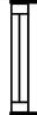
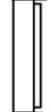
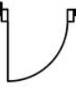

# Floor Play

## Data Preparation & Training

### Data Source: [SESYD](http://mathieu.delalandre.free.fr/projects/sesyd/symbols/floorplans.html)

> SESYD "Systems Evaluation SYnthetic Documents" is a database of synthetical documents, with the corresponding groundtruth, produced using the 3gT system.

Here, the floor plan collection is used.

### Model: [YOLOv5](https://github.com/ultralytics/yolov5)

> YOLO is a family of object detection architectures and models pretrained on the COCO dataset, and represents Ultralytics open-source research into future vision AI methods, incorporating lessons learned and best practices evolved over thousands of hours of research and development.

### Process

https://colab.research.google.com/drive/1-zGjeJG--licpHJ3KR1uwHx4uZYQiWR7?usp=sharing

## Inference

https://colab.research.google.com/drive/1C6vpt7aclephCBg7TMBe0uSH1LuH_d7q?usp=sharing

## Limitation

Because in training data, the windows are like

and

Doors are like

if your input image uses different symbols, the model can't recognize them.
